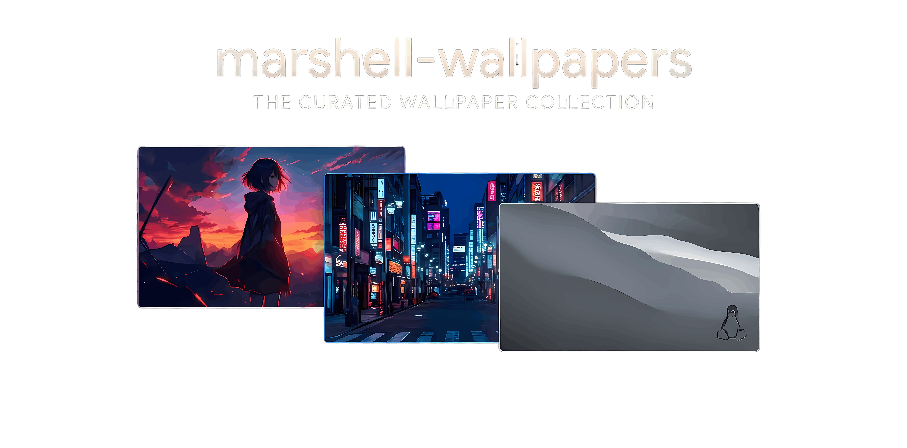

<div align="center">
    
</div>

## 📌 Overview

`marshell-wallpapers` is actively maintained personal collection of high-quality wallpapers, organized by category and maintained with a consistent structure, naming scheme, and metadata format.

The project follows a set of conventions for:

- Collection organization
- File naming
- Image formats and optimization
- Metadata
- Repository maintenance and automated generation tasks

Each collection is self-contained and provides its own documentation and preview through its respective `README.md`.

---

## 🏗️ Repository Structure

```text
.
├── anime/
│   ├── chainsaw-man/
│   ├── demon-slayer/
│   └── jujutsu-kaisen/
│
├── automotive/
├── cityscape/
├── os/
│
├── LICENSE
└── README.md
```

> [!NOTE]
> Each category contains curated high-quality wallpapers grouped by theme, series, or aesthetic.

---

## 📜 License

This project is licensed under the MIT License.

See the [LICENSE](LICENSE) file for full details.
