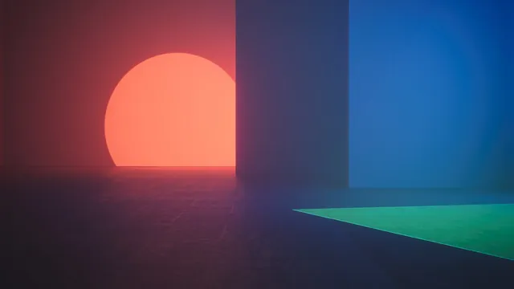

# Geometry

An abstract collection built around geometric forms, including shapes, lines, patterns, and structured compositions. The designs range from minimal, symmetrical layouts to more complex arrangements, with a focus on color, contrast, and repetition.

## Gallery

<!-- GENERATED:GALLERY:START -->

  

<!-- GENERATED:GALLERY:END -->

  Generated automatically by <code>marshell-wallpapers</code>

