# Chainsaw Man

A collection reflecting the gritty tone of _Chainsaw Man_, which combines horror, dark comedy, and action. It draws on devil-themed imagery, urban Japanese environments, and a raw, high-contrast visual style that sets the series apart from more conventional shonen anime.

## Gallery

<!-- GENERATED:GALLERY:START -->

  <a href="./assets/chainsaw-man-000001.webp">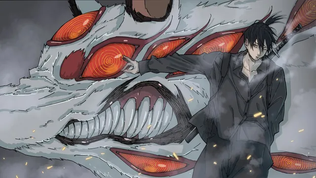</a>
  <a href="./assets/chainsaw-man-000002.webp">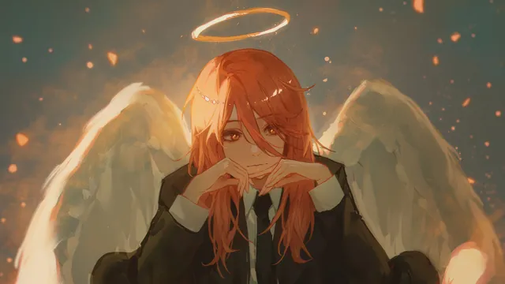</a>

  <a href="./assets/chainsaw-man-000003.webp">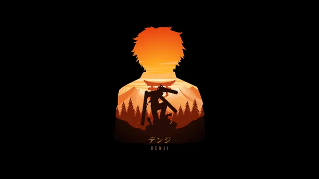</a>
  <a href="./assets/chainsaw-man-000004.webp">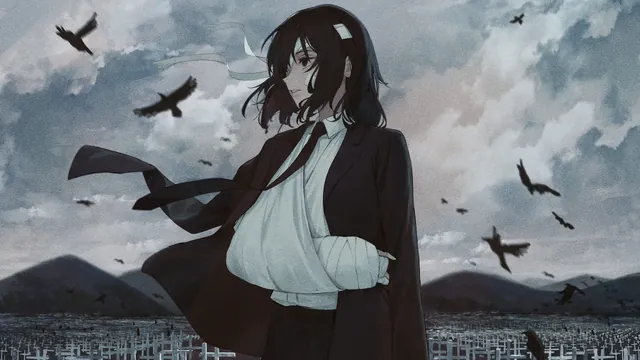</a>

  <a href="./assets/chainsaw-man-000005.webp">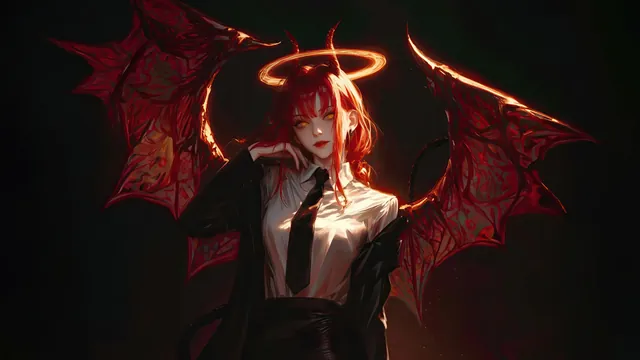</a>
  <a href="./assets/chainsaw-man-000006.webp">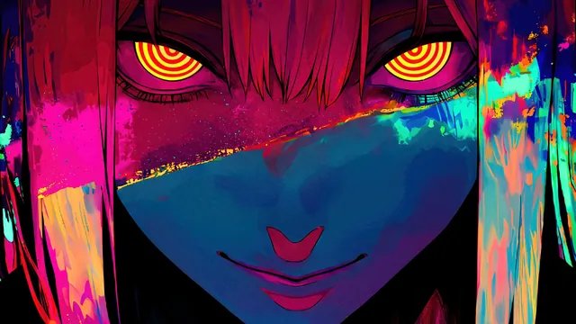</a>

  <a href="./assets/chainsaw-man-000007.webp">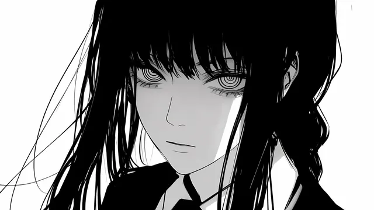</a>
  <a href="./assets/chainsaw-man-000008.webp">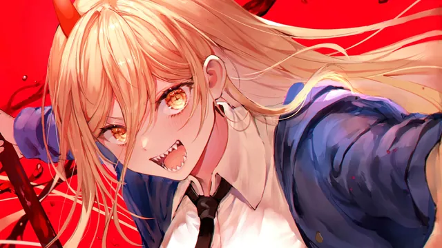</a>

  <a href="./assets/chainsaw-man-000009.webp">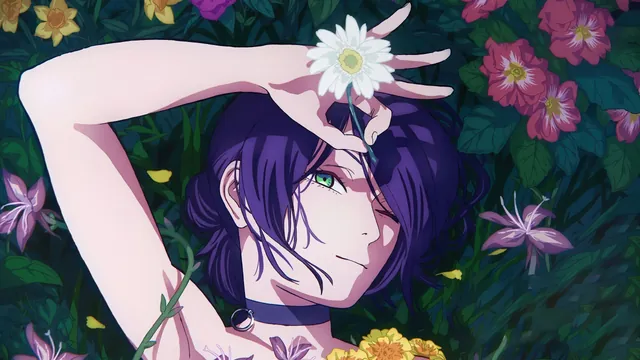</a>
  <a href="./assets/chainsaw-man-000010.webp">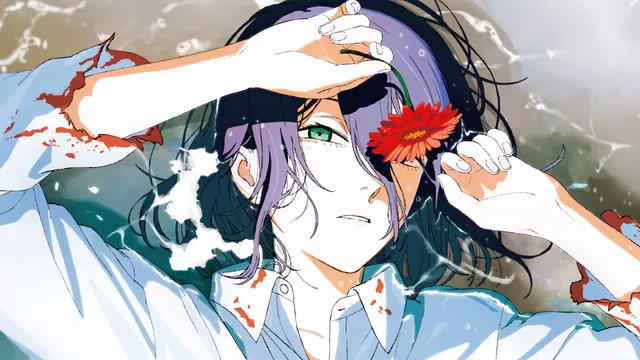</a>

  <a href="./assets/chainsaw-man-000011.webp">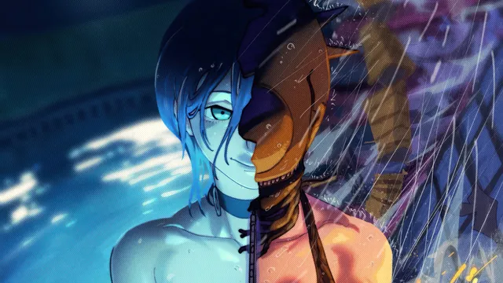</a>
  <a href="./assets/chainsaw-man-000012.webp">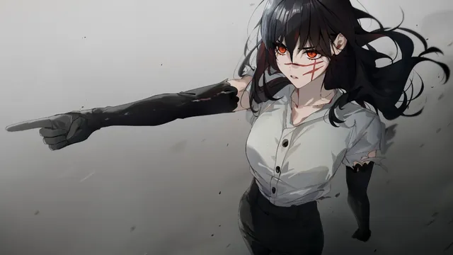</a>

  <a href="./assets/chainsaw-man-000013.webp">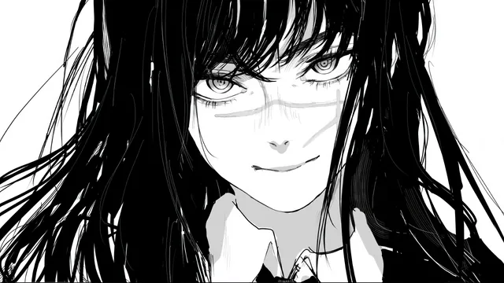</a>

<!-- GENERATED:GALLERY:END -->

  Generated automatically by <code>marshell-wallpapers</code>

