# Darling In The Franxx

Artwork drawn from _Darling in the FranXX_, a mecha anime with a distinctive futuristic setting. The collection includes giant mechs, desolate landscapes, and the series' bold color palette, reflecting its blend of science fiction and youthful, emotional themes.

## Gallery

<!-- GENERATED:GALLERY:START -->

  <a href="./assets/darling-in-the-franxx-000001.webp">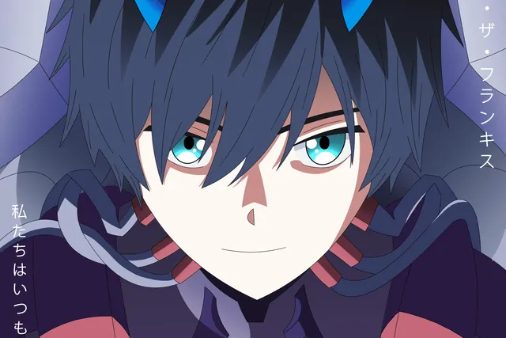</a>
  <a href="./assets/darling-in-the-franxx-000002.webp">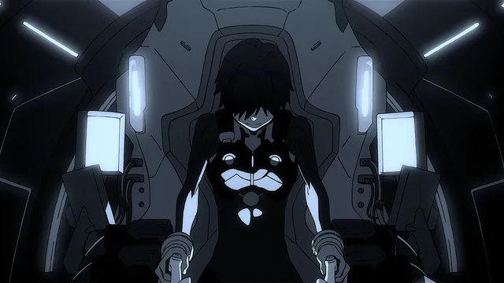</a>

  <a href="./assets/darling-in-the-franxx-000003.webp">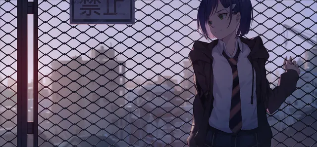</a>
  <a href="./assets/darling-in-the-franxx-000004.webp">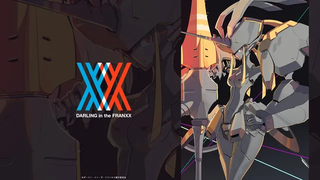</a>

  <a href="./assets/darling-in-the-franxx-000005.webp">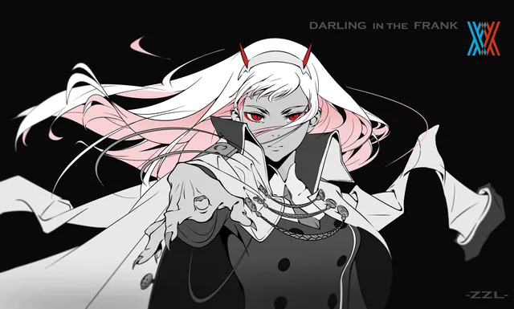</a>
  <a href="./assets/darling-in-the-franxx-000006.webp">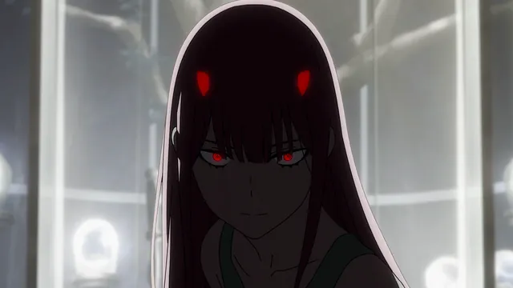</a>

  <a href="./assets/darling-in-the-franxx-000007.webp">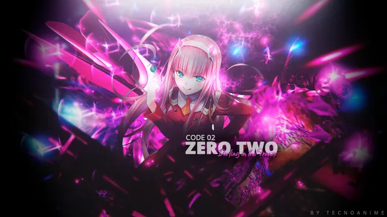</a>
  <a href="./assets/darling-in-the-franxx-000008.webp">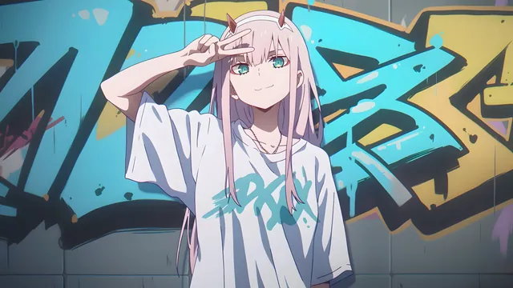</a>

  
  <a href="./assets/darling-in-the-franxx-000010.webp">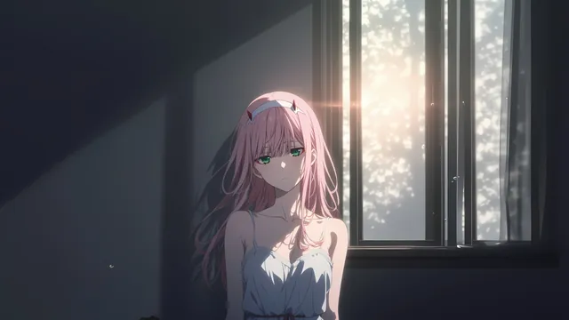</a>

  <a href="./assets/darling-in-the-franxx-000011.webp">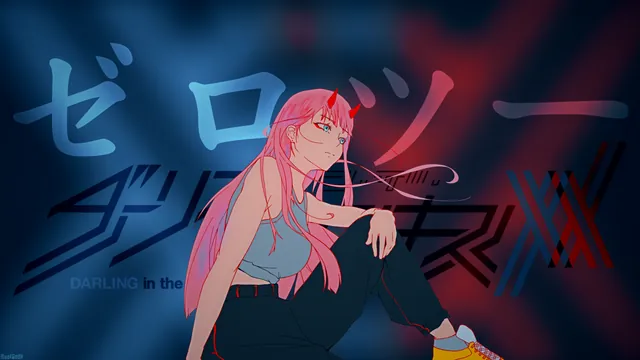</a>
  <a href="./assets/darling-in-the-franxx-000012.webp">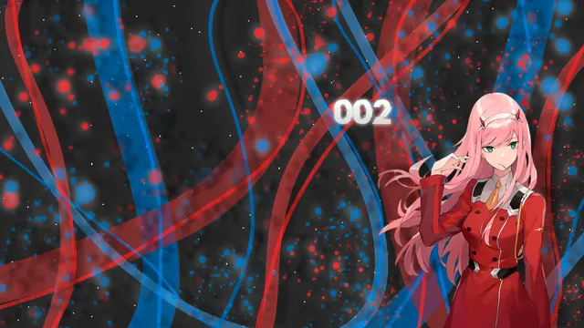</a>

<!-- GENERATED:GALLERY:END -->

  Generated automatically by <code>marshell-wallpapers</code>

