# Demon Slayer

A collection inspired by _Demon Slayer: Kimetsu no Yaiba_, set in Taisho-era Japan. It draws on traditional villages, forests, and mountain landscapes, along with the breathing-technique visual effects and demon-hunting atmosphere that define the series' mix of historical setting and dark fantasy.

## Gallery

<!-- GENERATED:GALLERY:START -->

  <a href="./assets/demon-slayer-000001.webp">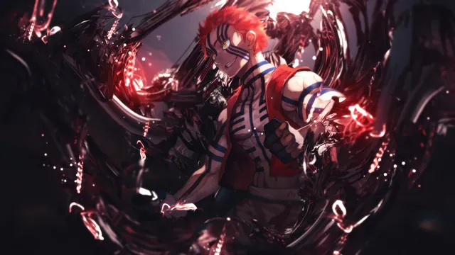</a>
  <a href="./assets/demon-slayer-000002.webp">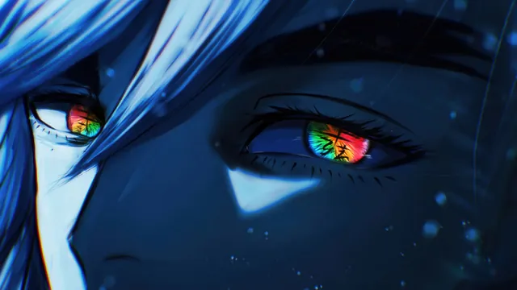</a>

  <a href="./assets/demon-slayer-000003.webp">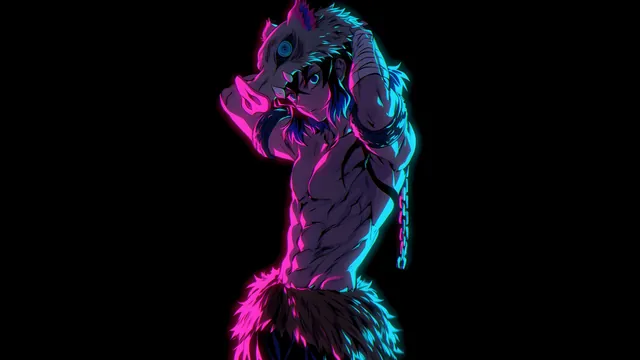</a>
  <a href="./assets/demon-slayer-000004.webp">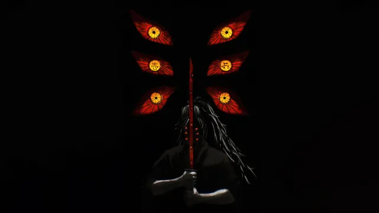</a>

  <a href="./assets/demon-slayer-000005.webp">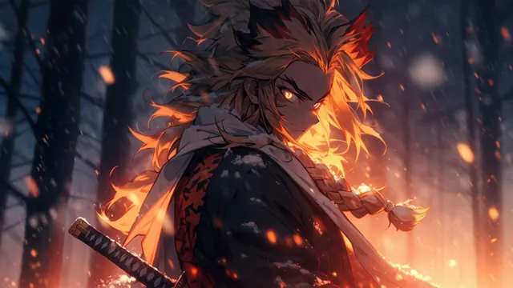</a>
  <a href="./assets/demon-slayer-000006.webp">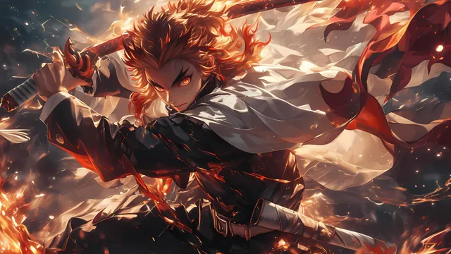</a>

  <a href="./assets/demon-slayer-000007.webp">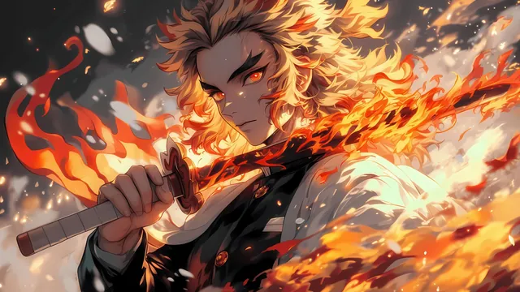</a>
  <a href="./assets/demon-slayer-000008.webp">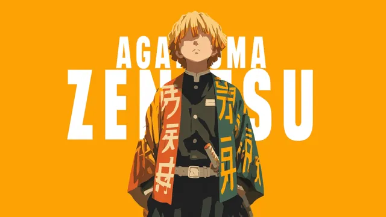</a>

  <a href="./assets/demon-slayer-000009.webp">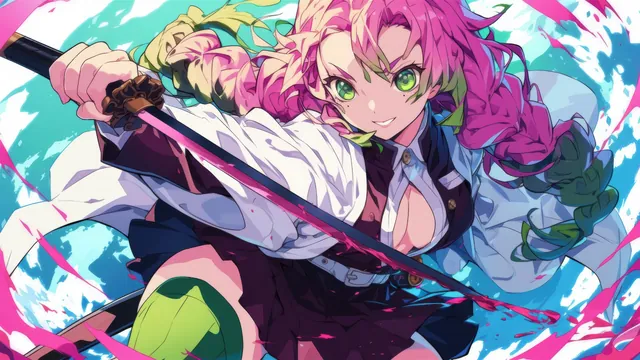</a>
  <a href="./assets/demon-slayer-000010.webp">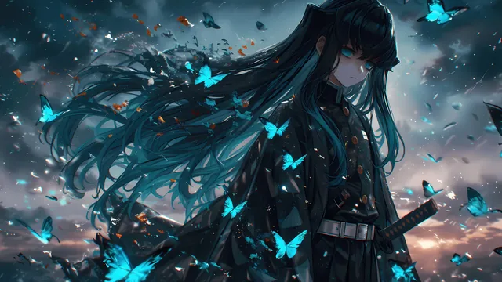</a>

  <a href="./assets/demon-slayer-000011.webp">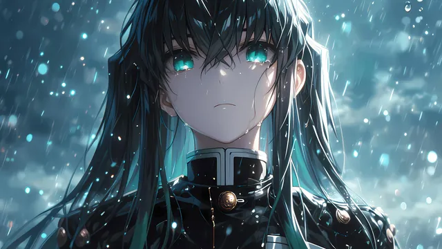</a>
  <a href="./assets/demon-slayer-000012.webp">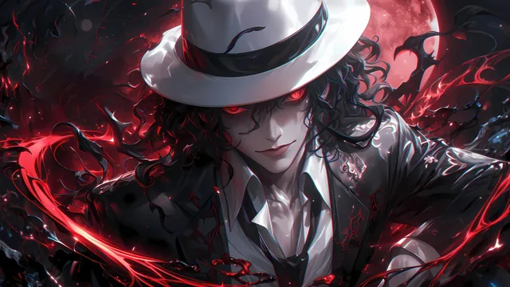</a>

  <a href="./assets/demon-slayer-000013.webp">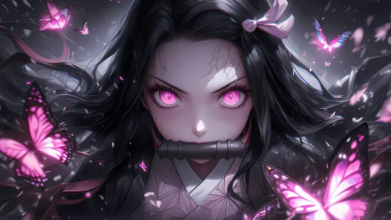</a>
  <a href="./assets/demon-slayer-000014.webp">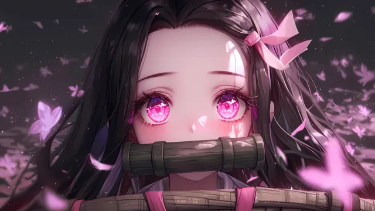</a>

  <a href="./assets/demon-slayer-000015.webp">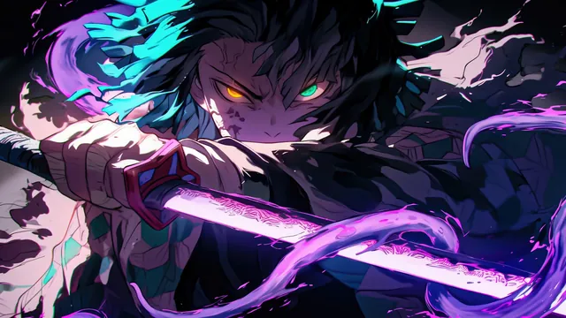</a>
  <a href="./assets/demon-slayer-000016.webp">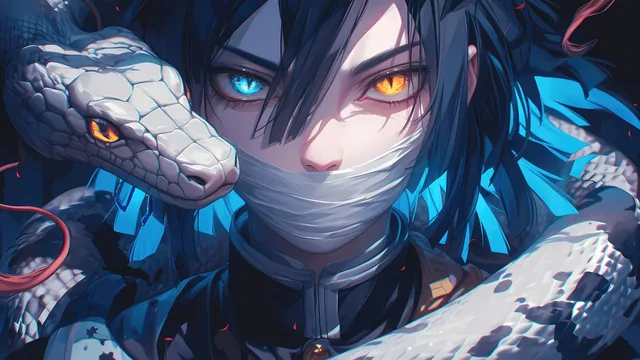</a>

  <a href="./assets/demon-slayer-000017.webp">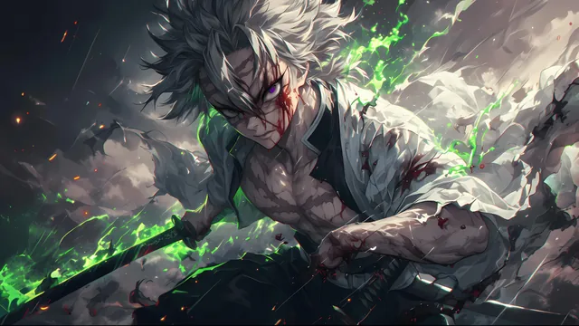</a>
  <a href="./assets/demon-slayer-000018.webp">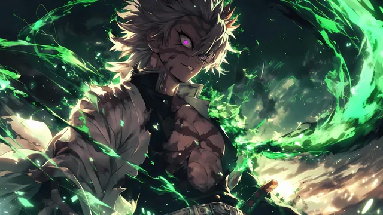</a>

  <a href="./assets/demon-slayer-000019.webp">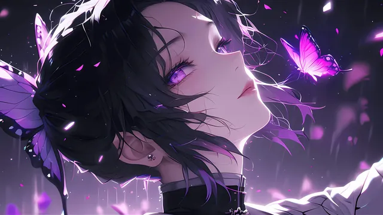</a>
  <a href="./assets/demon-slayer-000020.webp">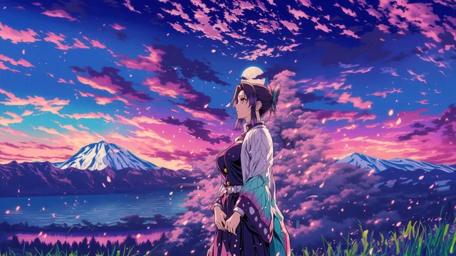</a>

  <a href="./assets/demon-slayer-000021.webp">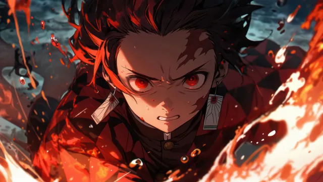</a>
  <a href="./assets/demon-slayer-000022.webp">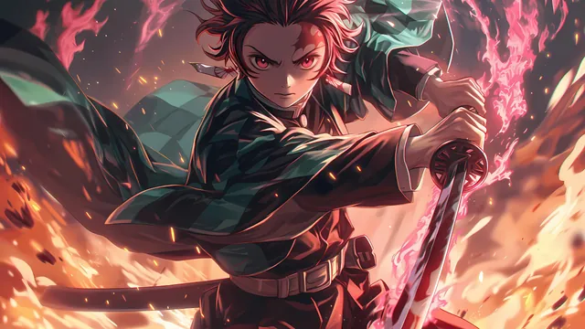</a>

  <a href="./assets/demon-slayer-000023.webp">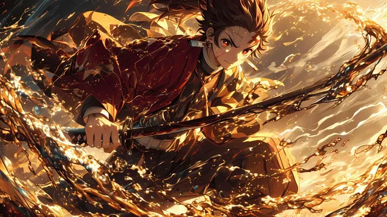</a>
  

  <a href="./assets/demon-slayer-000025.webp">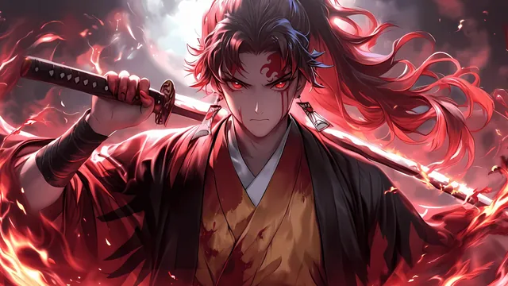</a>
  <a href="./assets/demon-slayer-000026.webp">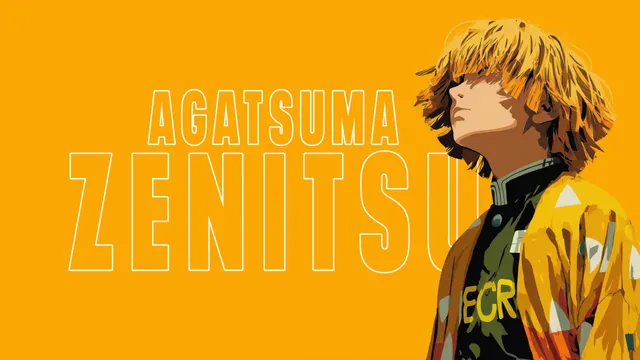</a>

  
  <a href="./assets/demon-slayer-000028.webp">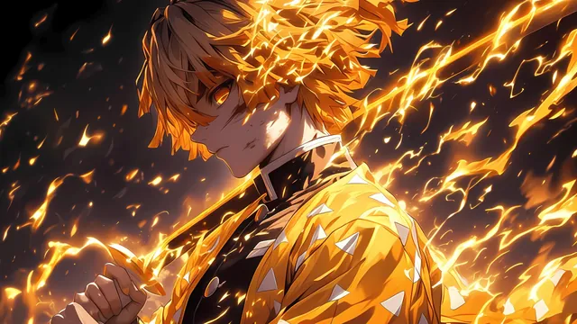</a>

  <a href="./assets/demon-slayer-000029.webp">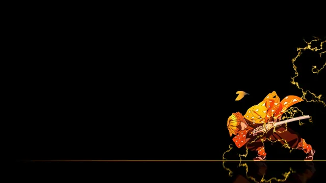</a>

<!-- GENERATED:GALLERY:END -->

  Generated automatically by <code>marshell-wallpapers</code>

