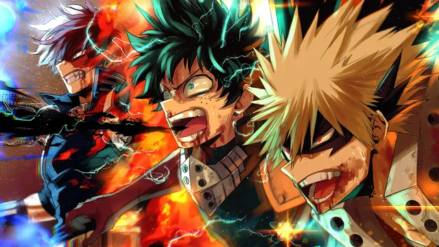
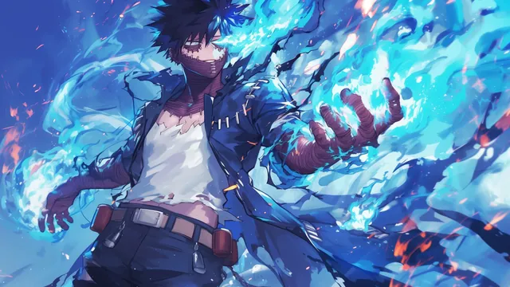
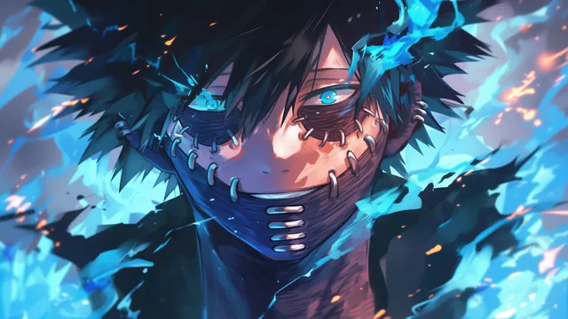
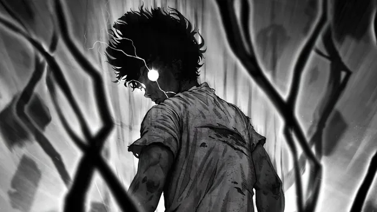
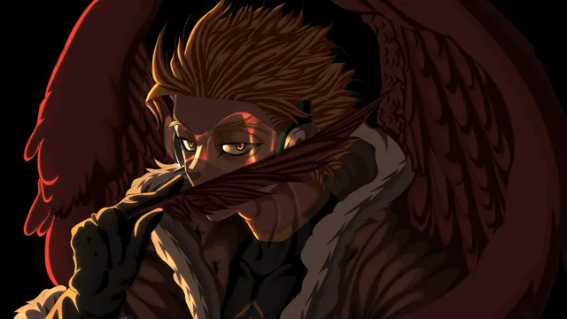
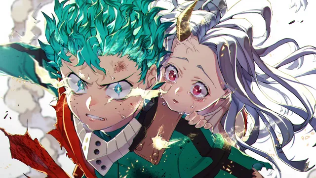
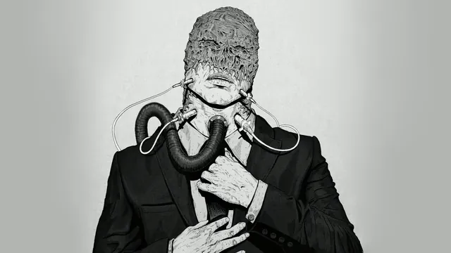
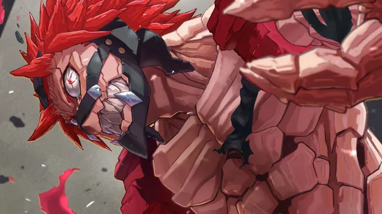
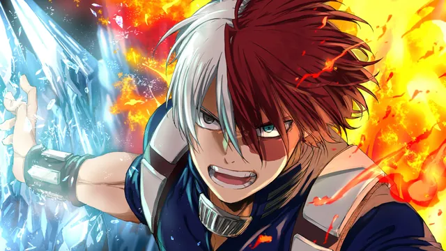

# My Hero Academia

Wallpapers set in the world of _My Hero Academia_, where most people are born with special abilities known as Quirks. The collection features hero-themed imagery, school and city environments, and the bright, energetic visual style associated with the series.

## Gallery

<!-- GENERATED:GALLERY:START -->

  
  

  
  

  
  

  
  

  

<!-- GENERATED:GALLERY:END -->

  Generated automatically by <code>marshell-wallpapers</code>

