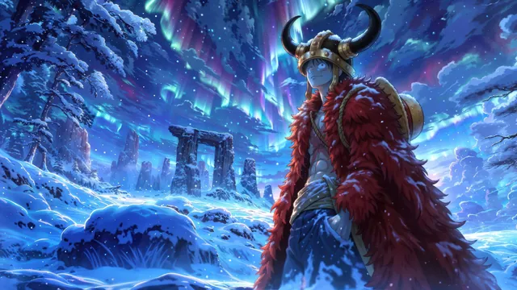
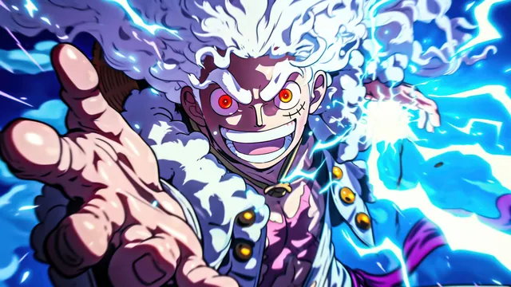
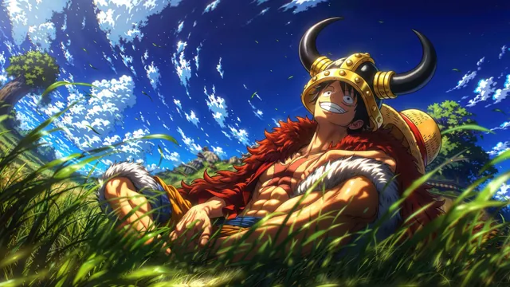
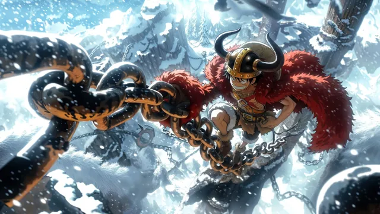
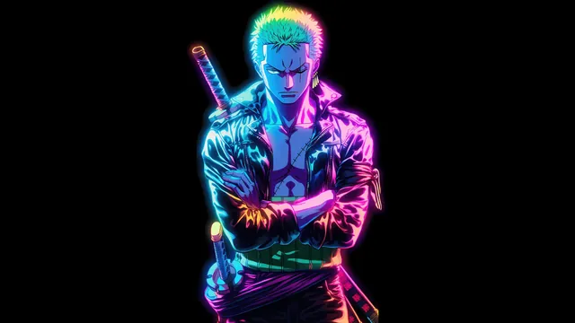
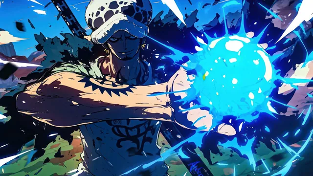

# One Piece

A collection centered on the pirate adventure of _One Piece_. It draws on sea voyages, island environments, ships, and the series' colorful, expressive art style, capturing the sense of exploration and open horizons that runs through the Grand Line.

## Gallery

<!-- GENERATED:GALLERY:START -->

  
  

  
  

  
  

  

<!-- GENERATED:GALLERY:END -->

  Generated automatically by <code>marshell-wallpapers</code>

