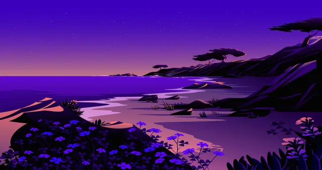
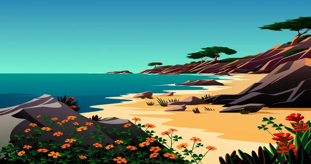
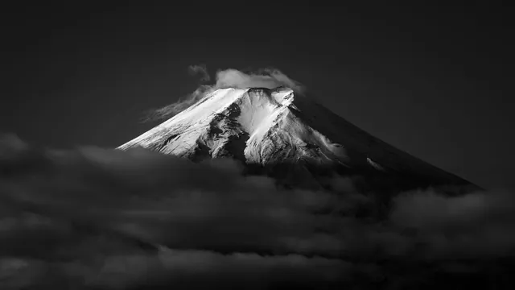
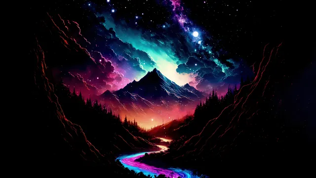
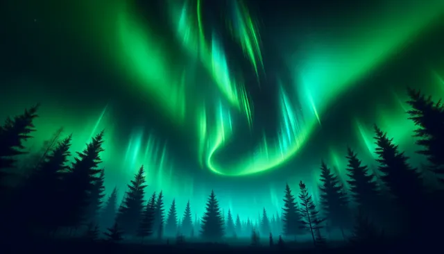
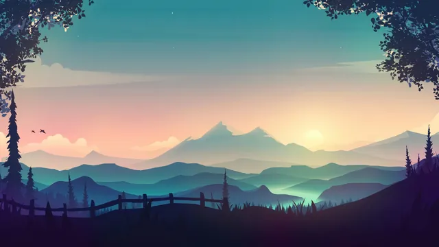

# Landscapes

A collection of natural scenery, including mountains, forests, coastlines, lakes, and open plains. The wallpapers capture different seasons, times of day, and weather conditions, ranging from wide panoramic views to quieter, more detailed scenes of the natural world.

## Gallery

<!-- GENERATED:GALLERY:START -->

  
  

  
  

  
  

<!-- GENERATED:GALLERY:END -->

  Generated automatically by <code>marshell-wallpapers</code>

