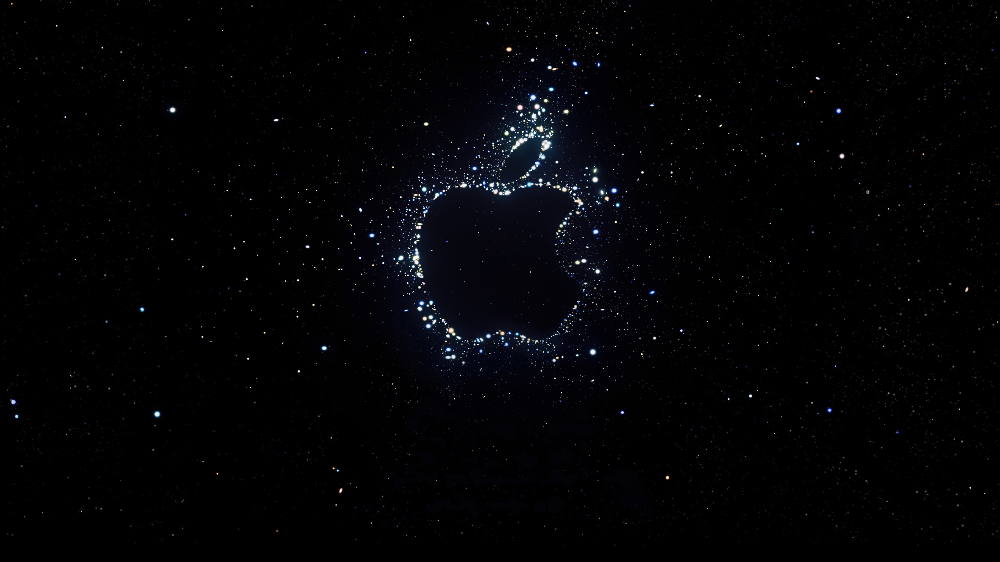
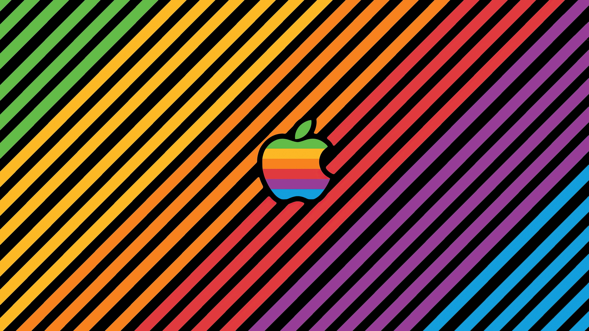
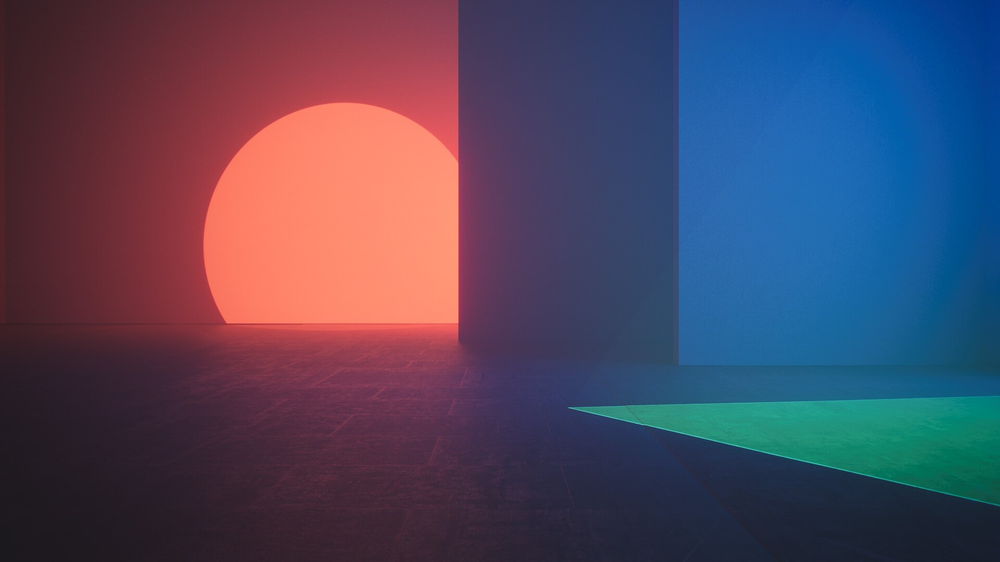

# Os Wallpapers

---

## Gallery

<table>
<tr>
<td></td>
<td></td>
</tr>
</table>

<table>
<tr>
<td></td>
<td></td>
</tr>
</table>

<table>
<tr>
<td></td>
<td></td>
</tr>
</table>

<table>
<tr>
<td></td>
<td></td>
</tr>
</table>

<table>
<tr>
<td></td>
<td></td>
</tr>
</table>

<table>
<tr>
<td></td>
<td></td>
<td></td>
</tr>
</table>

---

  Generated automatically by <code>marshell-wallpapers</code>

