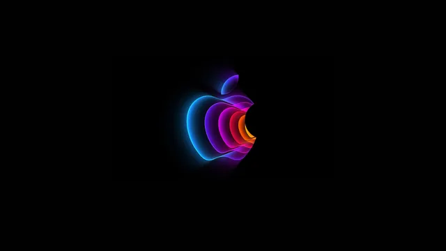
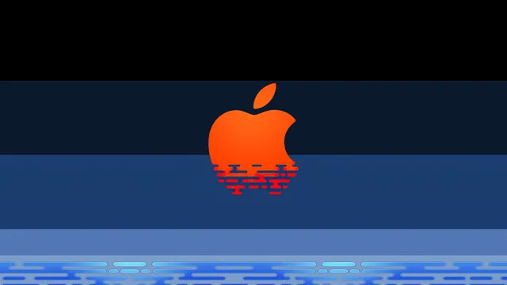
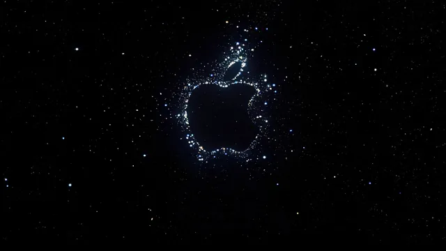
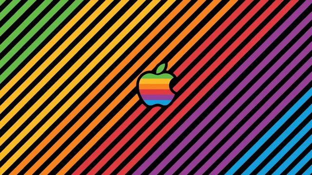

# Apple

A collection tied to _Apple_'s operating systems and hardware, including macOS, iOS, and related branding. The wallpapers reflect the company's clean, minimal design language, with gradients, abstract forms, and system-inspired compositions.

## Gallery

<!-- GENERATED:GALLERY:START -->

  
  

  
  

  
  

<!-- GENERATED:GALLERY:END -->

  Generated automatically by <code>marshell-wallpapers</code>

