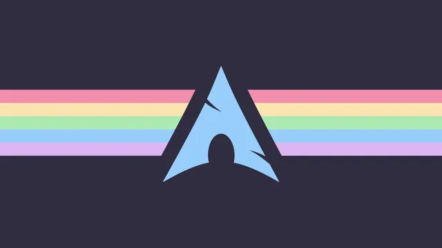
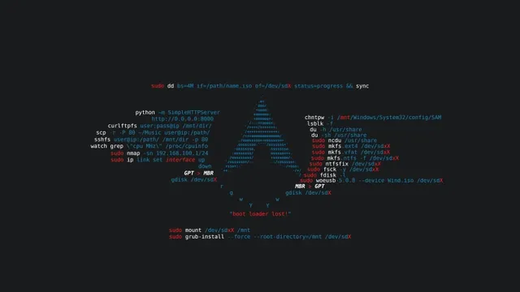
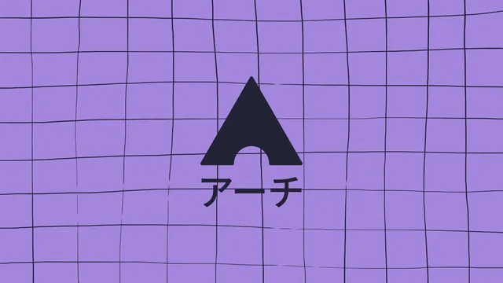
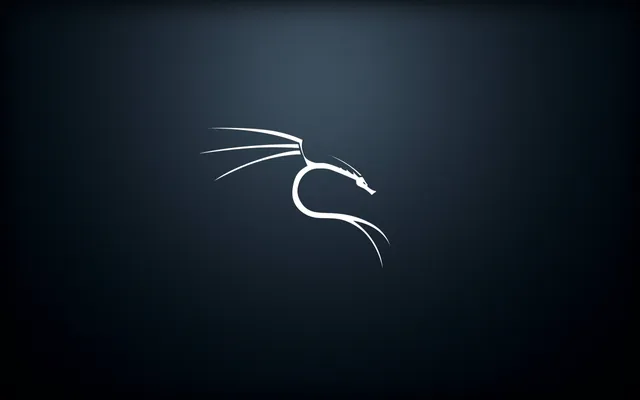
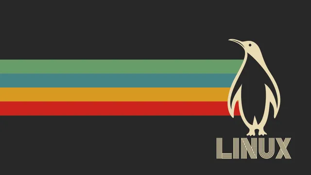
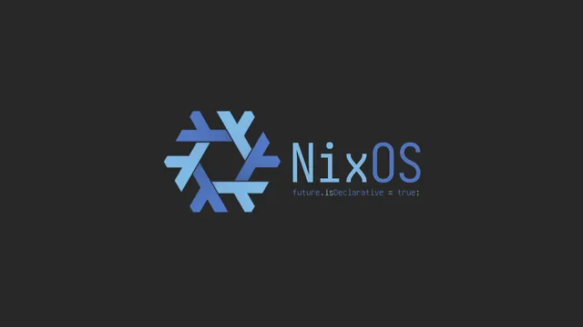

# Linux

A collection centered on the _Linux_ ecosystem, featuring Tux, distribution branding, desktop environments, terminals, and open-source themes. The wallpapers reflect the variety of the Linux world, from minimal desktop setups to designs tied to individual distributions.

## Gallery

<!-- GENERATED:GALLERY:START -->

  
  

  
  

  
  

  
  

  

<!-- GENERATED:GALLERY:END -->

  Generated automatically by <code>marshell-wallpapers</code>

