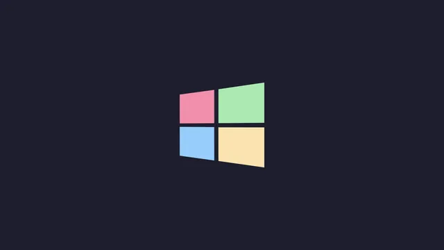
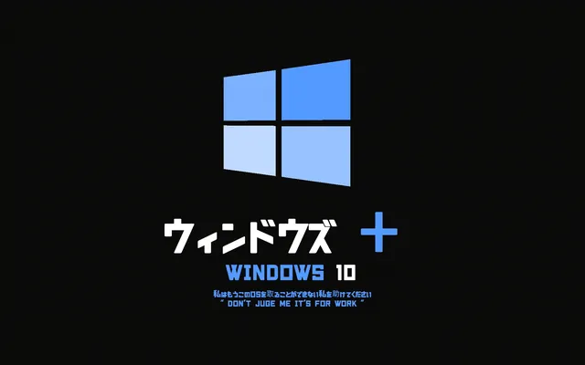
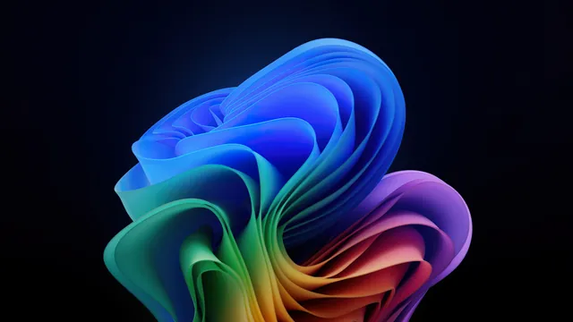
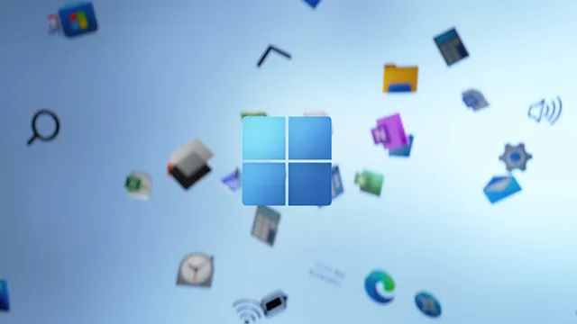
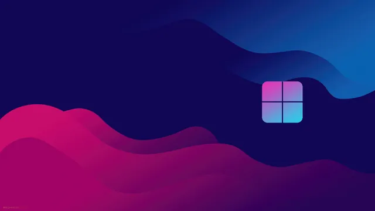
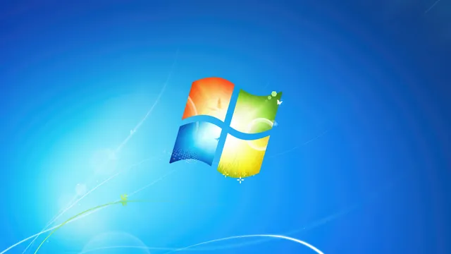

# Windows

A collection related to _Microsoft Windows_, featuring its logos, interface elements, and design styles associated with different versions of the system. The wallpapers range from classic looks to more modern releases, reflecting how the visual identity has evolved over time.

## Gallery

<!-- GENERATED:GALLERY:START -->

  
  

  
  

  
  

<!-- GENERATED:GALLERY:END -->

  Generated automatically by <code>marshell-wallpapers</code>

